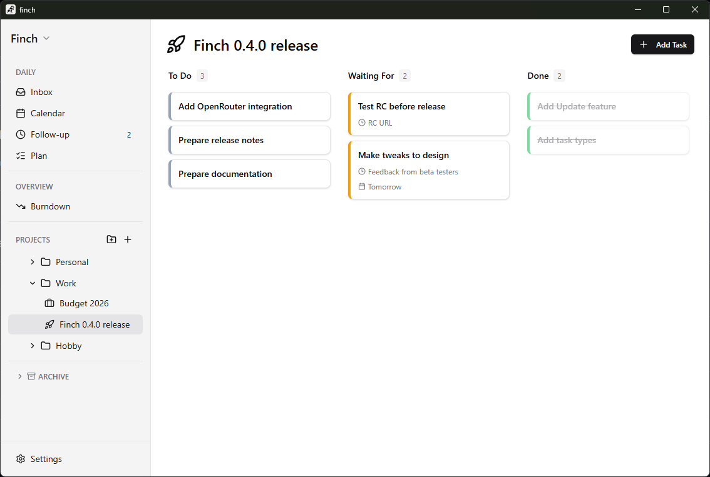

  

<h1 align="center">Finch</h1>

  <strong>Smart minimalistic task manager</strong>

  macOS · Windows

---

---

## Features

### Task Management
- **Kanban board** view for each project with To Do, Waiting For, and Done columns
- **Highlight** important tasks with starring
- **Due dates** with automatic overdue detection
- Drag-and-drop tasks between projects and states

### Smart Views
- **Inbox** — Central place to capture tasks quickly
- **Calendar** — Weekly and monthly view with drag-and-drop scheduling
- **Follow-up** — See all overdue and waiting-for tasks in one place
- **Plan** — Ordered task list for sprint-style planning
- **Burndown** — Track your completed task history

### Organization
- **Projects** with custom icons
- **Nested folders** for hierarchical organization
- **Archive** completed projects
- **Multiple workspaces** to separate work and personal tasks

### Productivity
- **Global hotkey** for quick task entry from anywhere
- **Drag-and-drop** everywhere
- **Real-time counters** show pending tasks at a glance
- **Dark and light themes**

---

## Download

Download the latest version from [Releases](https://github.com/yurish/finch-releases/releases).

---

## Tech

Built with [Tauri](https://tauri.app), React, and Rust. All data stored locally using SQLite.
